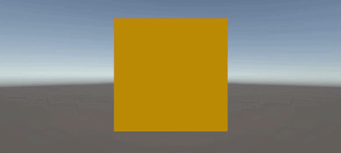

# native-gfx-plugin

Minimal native render plugin showing how to update a Unity-owned
`GraphicsBuffer` from native code:



The buffer is initialized inside a URP Render Graph pass (`NativeRenderSetup`).
Its native pointer is retrieved once during initialization and handed to the
native plugin.

The plugin maintains a ring of staging buffers and handles versioning, issuing a
GPU copy from the current frame's staging buffer into the Unity-owned
`GraphicsBuffer` each frame.

**Notes:**
1. `GraphicsBuffer.GetNativeBufferPtr` is a blocking call, since the native resource may not be ready by the time you call this function, or the render thread may alter the resource (invalidating your pointer).  So the main thread must block and synchronize with the render thread. This example calls it **once** during initialization to avoid syncing.
2. If the resource is used by the GPU, calling `GraphicsBuffer.SetData` can allocate a new resource for the frame. `SetData` should only be called once on init so the pointer to the Unity-owned buffer remains valid.

## Build the plugin

Both builds require the Unity Native Plugin API headers, located in the
`PluginAPI` folder of your installed Unity Editor.

**macOS (Metal)** — requires the Clang toolchain (Xcode Command Line Tools):

```bash
./build.sh "/Applications/Unity/Hub/Editor/<version>/Unity.app/Contents/PluginAPI"
```

**Windows (D3D12)** — requires the MSVC compiler (run from a Visual Studio developer command prompt):

```bat
build.bat "C:\Program Files\Unity\Hub\Editor\<version>\Editor\Data\PluginAPI"
```


